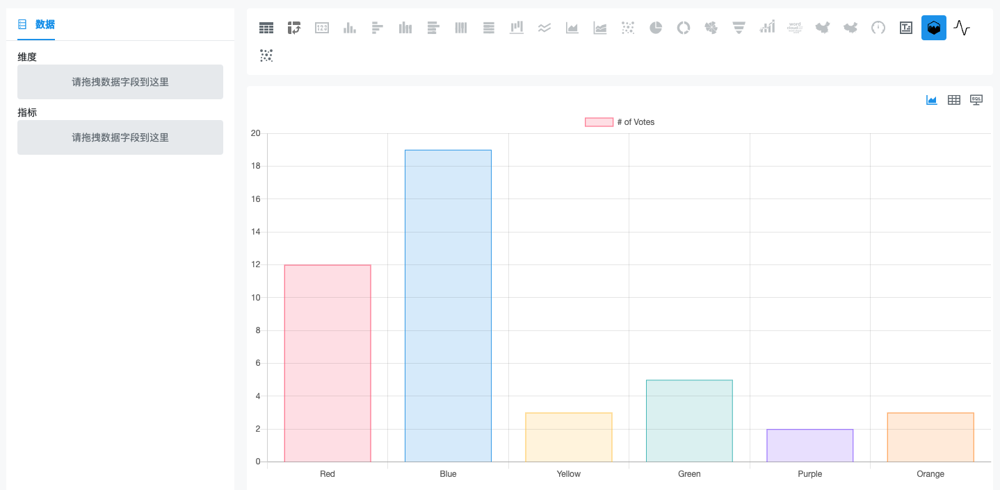
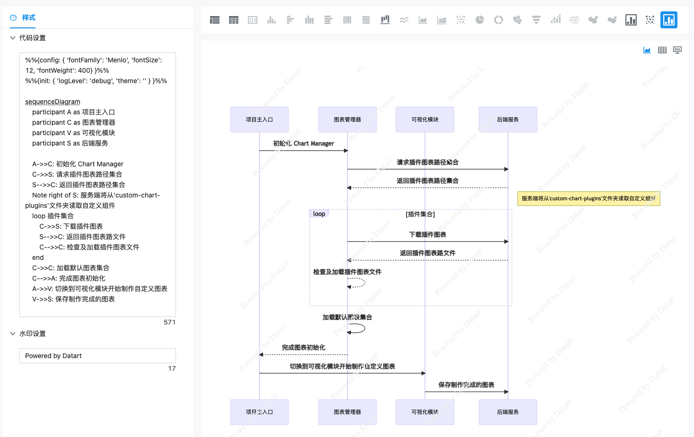
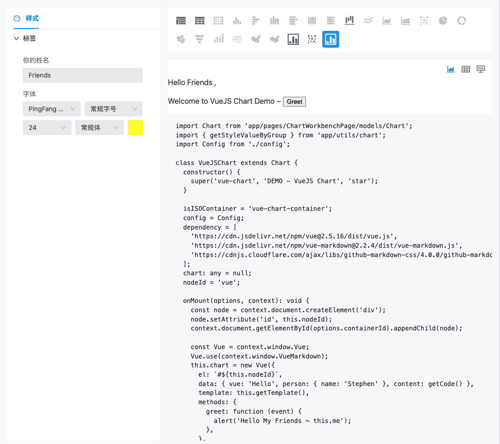
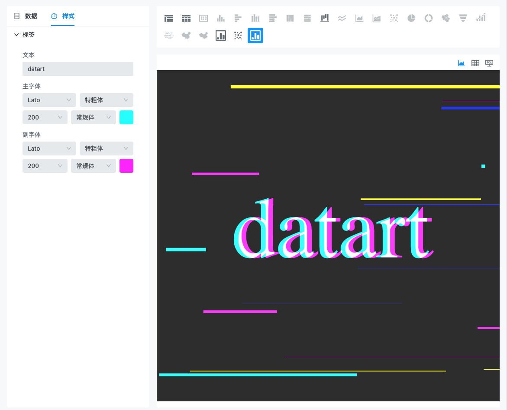

# datart-extension-charts

> An extension repository to host datart plugin charts which is in **experiment state not officially**🤝.

🖖 Welcome PRs or Issues, please don't be worry about any questions 👏.

## By Consumer

1. Copy `plugins` from `dist` folder, eg. `datart-amap.iife.js` file.
2. Paste to your datart backend server folder of `custom-chart-plugins`
3. Login datart, and select a your custom plugin chart.

## By Developer

> With this project, you can make yourself plugin chart and bundle with CLI.

### 1. Cook plugin chart as IIFE type (Recommended)

> IIFE also called Immediately Invoked Function Expression[^1], a programming language idiom which produces a lexical scope using function scoping.

1. Create a folder prefixed with `datart-`, such as `datart-hello-world`.
2. Create a plugin chart with **Javascript** or **Typescript** file
3. Plugin chart should be export an object with datart lifecycles[^2], such as `onMount`、`onUpdated` and etc.
4. Run `npm run build` and then check `dist` folder with file `datart-hello-world.iife.js`.
 __NOTE: Plugin folder should be prefix as `datart-*` which could be automatic load when run `build`__

### 2. Cook plugin chart as an React Component

**Please take a look plugins folder**

## Sample

    

        <h3>Antv/G2</h3>
        
    

    

        <h3>BabylonJS</h3>
        
    

     

        <h3>ChartJS</h3>
        
    

     

        <h3>ThreeJS-BingDunDun</h3>
        
    

     

        <h3>ThreeJS-WebGL</h3>
        
    

     

        <h3>ECharts-Time</h3>
        
    

     

        <h3>Mermaid-UML</h3>
        
    

     

        <h3>VueJS</h3>
        
    

     

        <h3>ZRender</h3>
        
    

## More Posts
- [x] Plugin Chart Helper API document: https://running-elephant.github.io/datart-docs/api/
- [x] How to Make a Plugin Chart: https://running-elephant.github.io/datart-docs/docs/chart_plugin.html
- [x] How to Make Chart Config: https://juejin.cn/post/7040683275446124574
- [x] Vue Carousel Plugin Chart:https://mp.weixin.qq.com/s/a4DVf-5LHVQAknmKKE6DJA
- [x] JQuery Plugin Chart：https://mp.weixin.qq.com/s/9hBNSla86Fzouy0WdXqSQQ
- [x] Hand by hand develop a plugin chart： https://mp.weixin.qq.com/s/nYMAaiT97NPkm71FpW8LSw

[^1]: https://en.wikipedia.org/wiki/Immediately_invoked_function_expression

[^2]: https://running-elephant.github.io/datart-docs/docs/chart_plugin.html